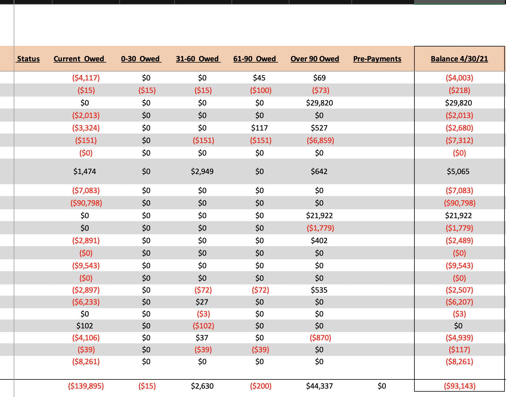
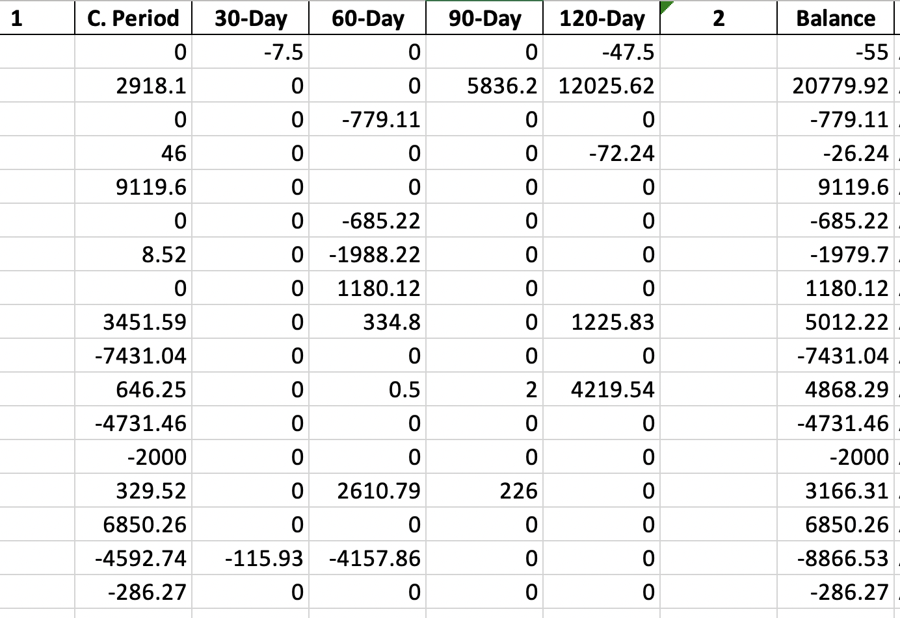

 

AutoARis a command line utility and web scraper that automates the extraction of data from accounting software and then filters the data into a format usable by decision makers. The script uses Selenium (web scraper) to download the reports, and then extracts the data using Python/openpyxl. After the reports are downloaded, the script formats the sheet and organizes it to easily be copied and pasted into other excel sheets.

This project started initially to save my coworkers and I time doing menial excel formatting simply to make data clear and presentable. Originally, cells and columns needed to be rearranged by hand, which took many hours away from more pressing work. To fix this, this script automates this process, which reduces the time taken to format the documents to only a couple of minutes.

I wanted to emphasize simplicity, so the script is installable to the command line and can be used in any folder.
